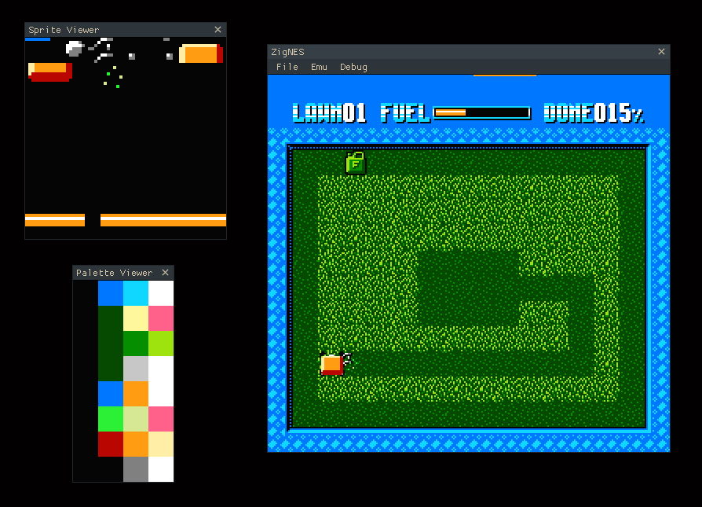

<h1 align=center>
    ZigNES 🕹️
</h1>  
<h4 align=center>
    NES emulator written in Zig with GUI using imgui.
</h4>

Currently, only the NROM mapper is supported and there is no sound.

This can run games like Super Mario Bros., Donkey Kong, and PacMan.

## Build

Clone this repository somewhere on your machine with the following:

`git clone --recurse-submodules https://github.com/jakehffn/zig-nes.git && cd zig-nes`

If environment variables for `SDL2_PATH` and `GLEW_PATH` are set, ZigNES can be built with,

`zig build`

The build file also expects the `SDL2` shared libary to have the extension, `.dll`, so other distributions of `SDL2` may require a little tweaking to `build.zig`.

## Usage
### Controls
| Key | Action |
|-----|---------|
| <kbd>W</kbd>,<kbd>A</kbd>,<kbd>S</kbd>,<kbd>D</kbd> | D-Pad |
| <kbd>J</kbd> | A Button |
| <kbd>K</kbd> | B Button |
| <kbd>Space</kbd> | Select |
| <kbd>Return</kbd> | Start |

## CPU tests
To test the CPU, Tom Harte's [nes6502 tests](https://github.com/TomHarte/ProcessorTests/tree/main/nes6502) are used. This is a suite of 10,000 tests for each of the 256 opcodes, both legal and illegal, which describes the initial and final state of the CPU after running one instruction.

Currently, the `ZigNES` CPU passes all 1.5 million test cases for the set of legal opcodes, excluding cycle timings.

The test set itself is not included in this repository due to the size of download. If you would like to run the tests yourself, the test runner expects the test cases to exist at the path `.\test-files\tom_harte_nes6502\v1` relative to the root of this project. 